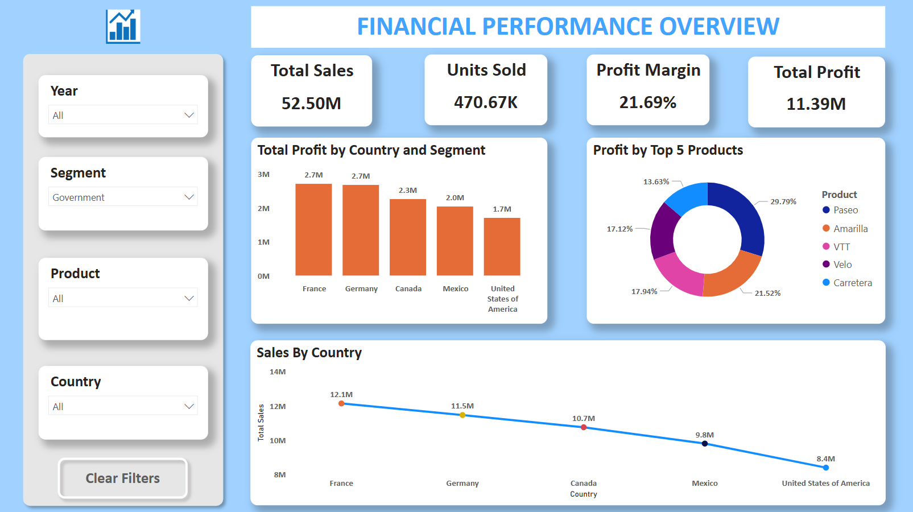

Financial Performance Dashboard - Power BI

This repository showcases a Power BI dashboard analyzing global sales performance across different countries, segments, and products.

🧾 Project Overview

Dashboard Name: Financial Performance Overview
Created With: Microsoft Power BI
Dataset:`Financials_Cleaned.csv`
Purpose: Provide a clear snapshot of total sales, profit, and top-performing markets/products.

📈 Key Visuals

KPI Cards: Total Sales, Units Sold, Profit Margin, Total Profit
Donut Chart: Profit by Top 5 Products
Bar Chart: Total Profit by Country and Segment
Line Chart: Sales by Country
Slicers: Year, Segment, Product, Country for dynamic filtering

📸 Dashboard Preview

🔍 Insights from the Dashboard

- France and Germany lead in profitability.
- "Paseo" is the highest contributing product by profit.
- The Government segment was filtered for focused analysis.
- Sales trends show gradual decline across top countries from France to the USA.

📁 Files Included

| File Name              | Description                                |
|------------------------|--------------------------------------------|
| `Financial_Dashboard.pbix` | Power BI file with full report setup     |
| `Financials_Cleaned.csv`   | Raw data used in the dashboard            |
| `3.png`                    | Dashboard screenshot for preview          |
| `README.md`               | Documentation for this repository         |

📬 Feedback & Contributions

Your feedback is welcome! Feel free to fork the repo, raise issues, or suggest enhancements.

---

> Created by Shailza Sharma | [LinkedIn](https://www.linkedin.com/in/shailzassharma)
